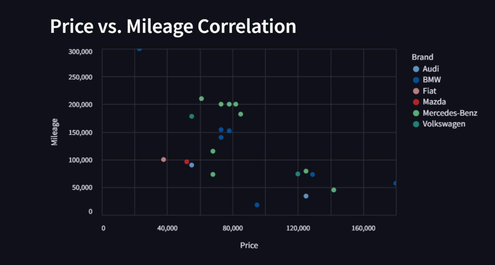
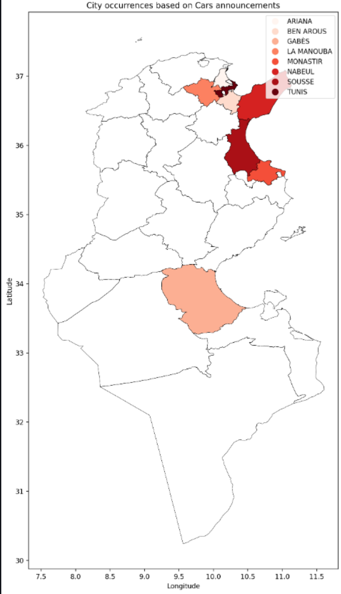
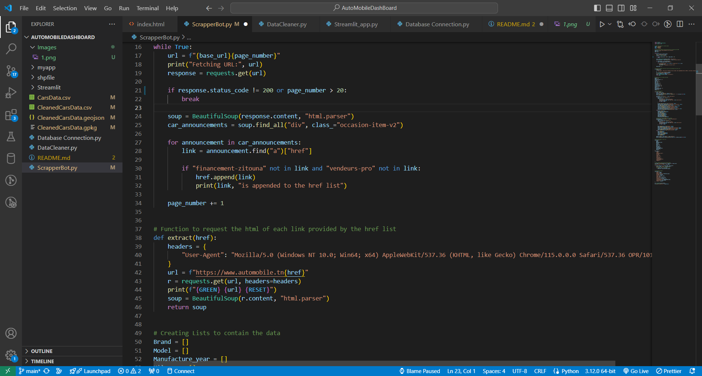
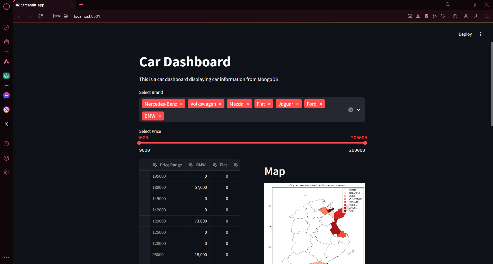

# AutoMobileDashBoard


This repository contains the code and data related to web scraping, data cleaning, and data visualization of the AutoMobile.tn website. The project aims to gather, process, and visualize data on the used cars market, giving it a geospatial aspect.

## Table of Contents

- [Introduction](#introduction)
- [Web Scraping](#web-scraping)
- [Data Cleaning](#data-cleaning)
- [Data Visualization](#data-visualization)
- [Setup Instructions](#setup-instructions)

## Introduction

This project aims to showcase the different aspects of the used cars market through analysis using Python.

## Web Scraping

The web scraping phase of this project was implemented using Python and the Beautiful Soup library. This process involved extracting data from the AutoMobile.tn website to collect information related to cars, including Brand, Type, Manufacture Year, Mileage, Price, Body Type, Fuel, Horse Power, Gear Box, Transmission, Color, Governorate, and Address.

**Key Steps:**

- Used the requests library to send HTTP requests to the AutoMobile.tn website.
- Iterated through multiple web pages to gather a list of individual announcements, then iterated through these announcements.
- Employed Beautiful Soup to parse the HTML content of the web pages and extract specific data elements, such as Brand, Type, Manufacture Year, Mileage, Price, Body Type, Fuel, Horse Power, Gear Box, Transmission, Color, Governorate, and Address.

**Challenges:**

- The website structure was complex and challenging to parse through.

## Data Cleaning

Cleaning the data involved eliminating duplicates, changing column data types, and preparing the data for visualization. For this, I used Pandas and GeoPandas.

## Data Visualization

For the data visualization part, I created a  Streamlit App to make  scatter plots, and to showcase geospatial files.

- **Scatter plots:**

  


- **Geospatial Aspect:**

  

## Setup Instructions

### Web Scraping Bot

**Directory:** `scraping_bot`

**Script:** `scrape_data.py`

**Description:** This script scrapes data from various sources and stores it in a specified format.


**Instructions:**

1. Run the script:
   ```bash
   python ScrapperBot.py

# Data Cleaning Script

## Script: `DataCleaner.py`

**Description:** This script cleans and processes the scraped data to ensure it is ready for storage and analysis.


**Instructions:**

1. Navigate to the `data_cleaning` directory.
2. Run the script:
    ```bash
    python clean_data.py
    ```

# MongoDB Connection Script


## Script: `Database Connection.py`

**Description:** This script connects to MongoDB and stores the cleaned data in the `Cars_data` database and collection.

**Instructions:**

# Node.js Server

## Directory: `nodejs_server`

### Script: `server.js`

**Description:** This server displays the data on an HTML page.

**Instructions:**

1. Navigate to the `nodejs_server` directory.
2. Install the required dependencies:
    ```bash
    npm install
    ```
3. Start the server:
    ```bash
    node server.js
    ```
4. Open a browser and navigate to `http://localhost:3000` to view the data.

# Streamlit App

## Directory: `Streamlit`

### Script: `Streamlit_app.py`

**Description:** This Streamlit app provides an interactive dashboard with a map to showcase the data.


**Instructions:**

1. Navigate to the `Streamlit` directory.
2. Install the required dependencies:
    ```bash
    pip install -r requirements.txt
    ```
3. Run the app:
    ```bash
    streamlit run Streamlit_app.py
    ```

# Conclusion

This project demonstrates the complete pipeline for scraping, cleaning, storing, and visualizing data using various technologies including Python, MongoDB, Node.js, and Streamlit. Follow the setup instructions for each component to get the project up and running.
